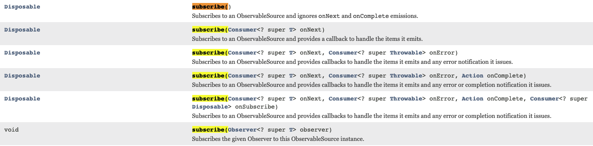
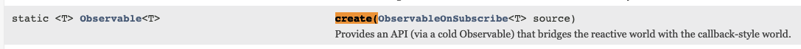

# 1.2. Observable 의 여러가지 팩토리 함수

## 참고자료

- [reactivex.org/RxJava/javadoc - overview-summary](http://reactivex.io/RxJava/javadoc/overview-summary.html)
- [reactivex.org/RxJava/javadoc - package summary](http://reactivex.io/RxJava/javadoc/io/reactivex/package-summary.html)
- [reactivex.org/Rxjava/javadoc - Observable](http://reactivex.io/RxJava/javadoc/io/reactivex/Observable.html)
- [reactivex.org/RxJava/javadoc - Disposable](http://reactivex.io/RxJava/javadoc/io/reactivex/disposables/Disposable.html)

<br>

## 요약

Observable의 데이터의 흐름을 만들어내는 함수들은 여러가지가 있다. 

- just() 함수
  - just() 함수는 데이터를 인자로 넣으면 자동으로 알림 이벤트가 발생한다.
- create() 함수
  - just() 함수와는 다르게 create() 함수는 onNext, onComplete, onError 와 같은 알림을 개발자가 직접 호출해야 한다.
- subscribe() 함수
- Disposable 객체
  - dispose() 메서드
  - isDisposed() 메서드
- create() 함수
- fromArray() 함수
- fromiterabloe() 함수
- fromCallable() 함수
- fromFuture() 함수
- fromPublisher() 함수

<br>

**Observable 클래스 내의 여러가지 팩토리 메서드들**<br>

Observable 내에는 객체를 여러가지 타입의 매개변수를 받아 객체를 만드는 함수들이 있다. 이 메서드들은 상황에 따라 다른 타입들을 인자로 받아서 Observable 객체로 만들기 위해 존재한다. <br>

이런 메서드들을 보통 소프트웨어 업계에서는 `팩토리 메서드` 라고 부르는 편이다. 이 `팩토리 메서드` 역할을 하는 메서드들은 Observable 클래스에서는, 이름을 보면 바로 파악할 수 있도록 create(), fromArray(), fromIterable(), fromCallable(), fromFuture(), fromPublisher() 와 같은 이름을 가지고 있다.<br>

**subscribe()**<br>

> 참고 : [reactivex.iog/RxJava/javadoc - Observable](http://reactivex.io/RxJava/javadoc/io/reactivex/Observable.html)

Observable 로 만들어낸 흐름을 구독하는 함수이다. subscribe 에는 여러가지 형식이 있다. onNext 만 받아서 처리하도록 만드는 경우도 있고, onNext, onError, onComplete 핸들러를 정의해서 사용하는 경우 역시 있다.<br>

참고) subscribe 메서드의 여러가지 형식들<br>

- 메서드 하나를 제외하고 모두 Disposable 객체를 리턴한다.



<br>

**dispose(), isDisposed()**<br>

dispose() 메서드는 구독을 해지하는 함수이다. Observable 클래스 내의 대부분의 subscribe() 메서드 들은 모두 Disposable 객체를 리턴한다. Disposable 은 RxJava 의 Subscription 객체에 해당한다.<br>

**Subsciption 객체**<br>

바로 이전에 살펴봤던 subscribe() 메서드들은 모두 Disposable 객체를 리턴한다. Disposable 은  RxJava 의 Subscription 객체에 해당한다. Subscription (구독) 객체는 아래와 같은 함수 명세를 가진다.<br>

## just() 함수

> 공식문서 : [http://reactivex.io/RxJava/javadoc/io/reactivex/Observable.html#just-T-](http://reactivex.io/RxJava/javadoc/io/reactivex/Observable.html#just-T-)

Observable 클래스의 just() 함수는 인자로 넣은 데이터를 차례로 발행하기 위해 Observable 인스턴스를 생성한다. (실제 데이터의 발행은 subscribe() 함수를 호출해야 발행이 시작된다.) 

Observable 클래스의 just() 함수에는 한 개의 값을 넣을 수도 있고 인자로 여러 개의 값(최대 10개)을 넣을 수도 있다. 단, 타입은 모두 같아야 한다.<br>

just () 함수는 일종의 팩토리 함수라고 생각할 수 있다. Observable 은 just() 등의 팩토리 함수로 데이터 흐름을 정의한다.<br>

이렇게 만들어낸 데이터의 흐름은 subscribe() 함수를 호출해야 실제로 데이터를 받아서 처리가 가능하다.<br>

**`Observable.just(T)`**<br>


이미지 출처 : [reactivex.io](http://reactivex.io/RxJava/javadoc/io/reactivex/Observable.html#just-T-)<br>

Observable 에서 발행하는 데이터로 just() 함수를 거치면 입력한 원을 그대로 발행한다. 파이프 기호 `|` 는 데이터 발행이 완료(onComplete 이벤트) 되었음을 의미한다.

<br>

**`Observable.just(T, T, T, ...)`**<br>

아래의 경우는 인자를 2개 이상을 가지는 just() 함수의 마블다이어그램이다.


이미지 출처 : [reactivex.io](http://reactivex.io/RxJava/javadoc/io/reactivex/Observable.html#just-T-)<br>

just() 함수로 1 ~ 10 의 원을 1개씩 발행한다. (데이터의 내용을 변경하지 않고 그대로 발행한다.)<br>

데이터의 발행이 끝난 후에는 완료( `|` )한다.<br>

<br>

```java
@Test
@DisplayName("Observable_just_메서드연습")
public void Observable_just_메서드연습(){
  Observable.just(1,2,3,4,5,6,7)
    .subscribe(System.out::println);
}
```

출력결과

```plain
1
2
3
4
5
6
7
```

<br>

## subscribe() 함수

> RxJava 는 내가 동작시키기 원하는 것을 사전에 정의해두고, 실제 그것이 실행되는 시점을 조절할 수 있다. 이때 사용하는 것이 subscribe() 함수이다.<br>

참고

- [subscribe()](http://reactivex.io/RxJava/javadoc/io/reactivex/Observable.html#subscribe--)
  - onNext, onComplete 이벤트를 무시하고 onError 이벤트가 발생했을 경우에만 OnErrorNotImplementedException 을 throw 한다. 
  - 이런 이유로 Observable 로 작성한 코드를 테스트하거나 디버깅할 때 사용한다.
- [subscribe(Consumer)](http://reactivex.io/RxJava/javadoc/io/reactivex/Observable.html#subscribe-io.reactivex.functions.Consumer-)
  - onNext 이벤트를 처리한다.
  - onError 발생시 OnErrorNotImplementedException 을 throw 한다.
- subscribe(Consumer, Consumer\<? super Throwable\> onError)
  - onNext, onError 이벤트를 처리한다.
- subscribe(Consumer, Consumer<? Super Throwable\> onError, Action onComplete)
  - onNext, onError, onComplete 이벤트를 모두 처리할 수 잇다.

<br>

subscribe() 메서드는 Observable 을 구독한다. just() 함수만 호출하면 데이터를 발행하지 않는다. subscribe() 함수를 호출해야 구독자들에게 데이터를 발행할 수 있다. 이때 map(), flatMap() 과 같은 함수들을 이용하면 데이터를 변환해서 subscribe() 함수에 전달해줄 수 있다.<br>

<br>

일반적으로 Observable 클래스 내의 just() 와 같은 펙토리 함수로 데이터 흐름을 정의한 후에 subscribe() 함수를 호출해야 실제 데이터를 발행하는 것이 가능해진다.<br>

<br>

## Disposable 객체

> 참고 : [reactive.io/RxJava/javadoc/io/reactivex/disposables/Disposables.html](http://reactivex.io/RxJava/javadoc/io/reactivex/disposables/Disposable.html)<br>

바로 이전에 살펴봤던 subscribe() 메서드들은 모두 Disposable 객체를 리턴한다. Disposable 은  RxJava 의 Subscription 객체에 해당한다. Subscription (구독) 객체는 아래와 같은 함수 명세를 가진다.<br>

```java
void dispose() // Dispose the resource, the operation should be idempotent.
boolean isDisposed() // Returns true if this resource has been disposed.
```


### dispose() 메서드

- Observable 에게 더 이상 데이터를 발행하지 않도록 구독을 해지하는 함수이다. 
- Observable 계약에 따르면 onComplete 알림을 보냈을 때 자동으로 dispose() 를 호출해서 Observable 과 구독자의 관계를 끊는다.

<br>

### isDisposed() 메서드

- Observable 이 데이터를 발행하지 않는지 확인하는 함수
- 데이터를 발행하지 않는다는 것은 구독을 해지했다는 의미로도 해석할 수 있다.

<br>

isDisposed() 메서드 실제 활용 예제

```java
Observable <String> players = Observable.just("손흥민", "황의조", "지드래곤");

Disposable d = players.subscribe(
  v -> System.out.pritnln("onNext() : value : " + v),
  err -> System.out.println("onError() : err : " + err.getMessage()),
  () -> System.out.println("onComplete()")
);

System.out.println("isDisposed() : " + d.isDisposed());
```

<br>

출력결과<br>

- 차례대로 모든 값을 발행 한 후에는 onComplete 이벤트가 발생한다.
- 마지막으로 isDisposed() 함수를 이용해 구독이 정상적으로 해지되었는지 확인했는데, true 를 반환한 것을 보면 정상적으로 구독이 해지(dispose) 되었음을 유추할 수 있다.

```plain
onNext() : value : 손흥민
onNext() : value : 황의조
onNext() : value : 지드래곤
onComplete()
isDisposed() : true
```

<br>

## create() 함수

> 참고 : [reactivex.io/RxJava/javadoc - Observable.create](http://reactivex.io/RxJava/javadoc/io/reactivex/Observable.html#create-io.reactivex.ObservableOnSubscribe-)

just() 함수와는 다르게 create() 함수는 onNext, onComplete, onError 와 같은 알림을 개발자가 직접 호출해야 한다.

함수의 명세는 아래와 같다. ([참고](http://reactivex.io/RxJava/javadoc/io/reactivex/Observable.html#create-io.reactivex.ObservableOnSubscribe-))



<br>

마블 다이어그램<br>


