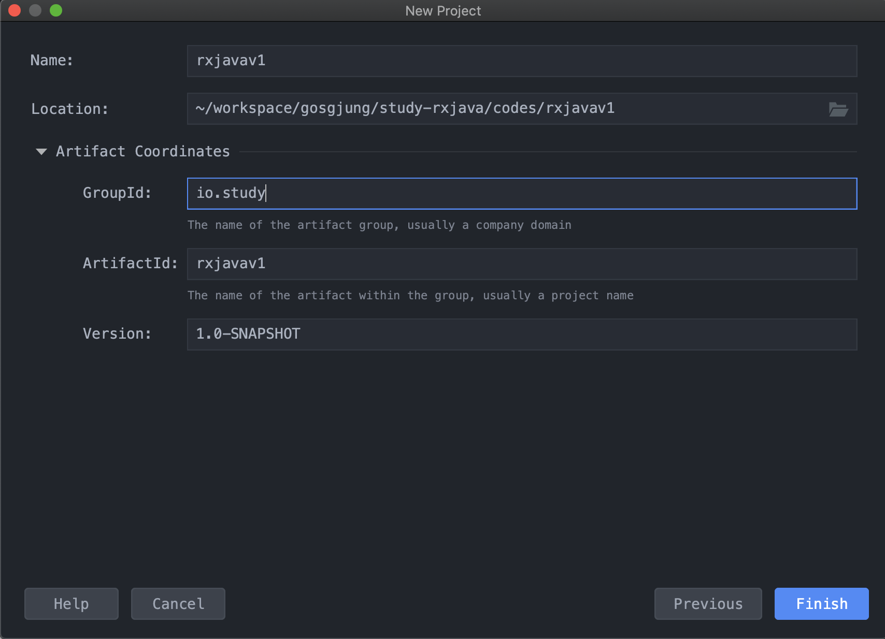

# 1.프로젝트 생성, Hello World 코드 작성해보기

실습환경 : Java 8 이상, IntelliJ<br>

(Intellij 가 아니어도 이클립스, 안드로이드 스튜디오 등등 모두 가능)<br>

<br>

## maven 프로젝트 생성

> maven 으로 생성해도 되고, gradle 로 생성해도 된다. 내 경우는 그냥 스터디 용도이기도 하고 빌드스크립트를 헤비하게 작성할 필요도 없고 해서 그냥 선언형 빌드 툴인 maven을 선택



<br>

## 의존성 추가

[rxjava2](https://mvnrepository.com/artifact/io.reactivex.rxjava2/rxjava) 를 의존성으로 추가해준다. 버전은 비교적 최신 버전인 2.2.19를 선택함.<br>

### gradle 의존성

```groovy
// https://mvnrepository.com/artifact/io.reactivex.rxjava2/rxjava
implementation group: 'io.reactivex.rxjava2', name: 'rxjava', version: '2.2.19'
```

<br>

### 메이븐 의존성

```xml
<!-- https://mvnrepository.com/artifact/io.reactivex.rxjava2/rxjava -->
<dependency>
    <groupId>io.reactivex.rxjava2</groupId>
    <artifactId>rxjava</artifactId>
    <version>2.2.19</version>
</dependency>
```


## HelloWorld 코드 작성해보기

src/main/java/io.study.rxjavav1.step1/HelloWorldRxJava.java

```java
public class HelloWorldRxJava {
	public static void main(String [] args){
		Observable<String> observable = Observable.just("Hello", "World", "RxJava");
		observable.subscribe(str -> System.out.println(str));
	}
}
```

<br>

출력결과

```plain
Hello
World
RxJava
```

<br>