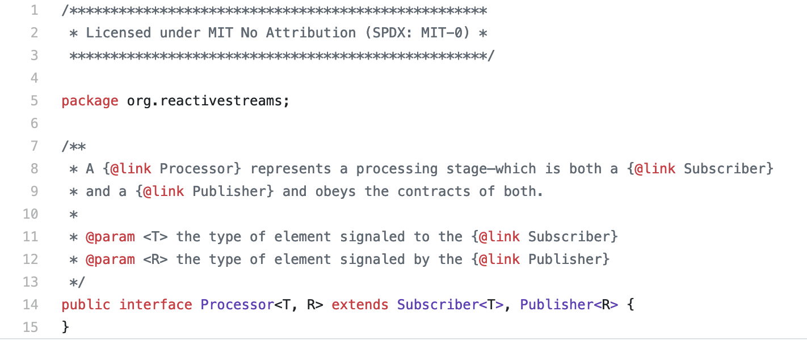

# 2-1.리액티브 스트림즈(Reactive Streams)란? & 용어정리

## 참고자료

- [Inflearn, Kevin의 알기쉬운 RxJava 1부](https://www.inflearn.com/course/%EC%9E%90%EB%B0%94-%EB%A6%AC%EC%95%A1%ED%8B%B0%EB%B8%8C%ED%94%84%EB%A1%9C%EA%B7%B8%EB%9E%98%EB%B0%8D-1/dashboard)

<br>

## Reactive Streams 란?

공식 페이지 

- [http://www.reactive-streams.org/](http://www.reactive-streams.org/)
- [http://reactive-streams.github.io](http://reactive-streams.github.io)

<br>

Reactive Streams 는 인터페이스이다. 하나의 규약이라고도 이야기한다. 실제로도 소스코드를 보면 public interface ... 와 같이 선언되어 있다.<br>

Processor 인터페이스의 코드를 깃헙에서 확인해보면 아래 그림처럼 interface 로 선언되어 있음을 확인 가능하다.<br>



<br>

Reactive Streams 는 4가지의 컴포넌트로 구성된다. 아래의 네가지 컴포넌트들은 모두 위 캡처에서 보았던 것처럼 인터페이스이다. 

- Publisher

- - 생산자
  - 데이터를 생성하고 통지하는 역할 수행

- Subscriber

- - 소비자
  - 통지된 데이터를 전달받아 처리하는 역할 수행

- Subscription

- - 전달받은 데이터의 갯수를 요청하고 구독을 해지하는 등의 역할을 수행

- Processor

- - Publisher와 Subscriber의 기능이 모두 가지고 있다.

<br>

> 참고)
>
> - 실제 소스코드는 https://github.com/reactive-streams/reactive-streams-jvm/tree/master/api/src/main/java/org/reactivestreams 에서 확인 가능하다.

<br>

이 4가지의 컴포넌트 들을 구현하고 있는 구현체는 여러가지가 있을 수 있다. 그중 하나가 RxJava 이다.<br>

(JPA는 인터페이스의 역할을 하지만, 그중 대중적으로 사랑받는 구현체가 hibernate 인 것을 생각한다면 이해가 쉽지 않을까 싶다.)<br>

<br>

## Publisher

> [https://github.com/reactive-streams/reactive-streams-jvm#1-publisher-code](https://github.com/reactive-streams/reactive-streams-jvm#1-publisher-code)

<br>

Publisher 는 subscribe 메서드를 구현해야 한다.<br>

Publisher 는 아래와 같이 생겼다. 인터페이스 내에 메서드가 하나인 것으로 보아 람다식으로 인스턴스를 생성하는 것을 인라인으로 생성해 전달할 수도 있겠구나 하고 유추가 가능하다.

```java
public interface Publisher<T> {
    public void subscribe(Subscriber<? super T> s);
}
```

<br>

소스코드

- https://github.com/reactive-streams/reactive-streams-jvm/blob/v1.0.3/api/src/main/java/org/reactivestreams/Publisher.java

<br>

## Subscriber

> [https://github.com/reactive-streams/reactive-streams-jvm#2-subscriber-code](https://github.com/reactive-streams/reactive-streams-jvm#2-subscriber-code)

<br>

네 개의 메서드를 구현해야 한다.

- onSubscribe

- - 데이터를 최초로 통지할 때 사용되는 메서드

- onNext

- - 데이터를 통지할 때마다 사용되는 메서드

- onError

- - 데이터 통지시 에러가 발생할 때 

- onComplete

- - 데이터 통지가 완료되었음을 알리는 역할

<br>

## Subscription

https://github.com/reactive-streams/reactive-streams-jvm#3-subscription-code

- request
- cancel

<br>

## Processor

https://github.com/reactive-streams/reactive-streams-jvm#4processor-code

<br>

## RxJava

reactive streams 를 구현하고 있는 구현체 라이브러리 중 하나이다.

<br>

# 데이터 통지

데이터를 전달하는 것, Publish 하는것, 생산자가 생산하는 것을 의미한다. 강의에서는 통지라는 말을 굉장히 자주하고 있다. 그래서 당분간은 용어를 통지=생산 이라고 일단은 잠시동안 정해놔야 할 것 같다.

<br>

# 데이터 처리

데이터를 처리하는 것. 데이터를 소비하는 것을 처리하는 것이라고 자주 이야기 되는 것 같다. 따라서 당분간은 용어를 처리 = 소비 라고 일단은 잠시동안 정해놔야 할 것 같다.

<br>