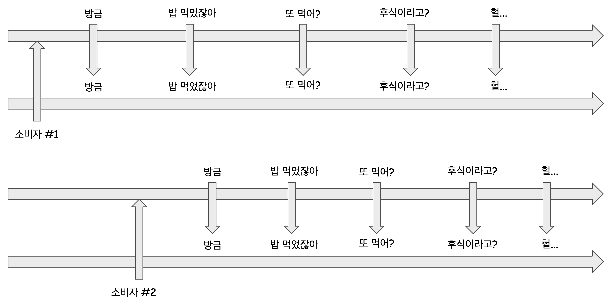

# 2-2. Publisher, Subcriber, Cold Publisher, Hot Publisher

## 참고자료

- [Inflearn, Kevin의 알기쉬운 RxJava 1부](https://www.inflearn.com/course/%EC%9E%90%EB%B0%94-%EB%A6%AC%EC%95%A1%ED%8B%B0%EB%B8%8C%ED%94%84%EB%A1%9C%EA%B7%B8%EB%9E%98%EB%B0%8D-1/dashboard)

<br>

## publisher, subscriber 통신구조

리액티브 모델 프로그래밍에서 Publisher 와 Subscriber 간에 통신을 하는 절차는 아래와 같다.


Publisher 의 종류는 두가지가 있다.

- Cold Publisher

- - 새로운 소비자가 구독할때마다 데이터를 처음부터 모두 전달받는다.

- Hot Publisher

- - 새로운 소비자가 구독할때는 처음부터 데이터를 전달받지 않고, 구독 시점의 데이터부터 전달받는다.

<br>

## Cold Publisher

대기열에 조금 늦게 들어오더라도, 처음부터 생성된 데이터들을 모두 한꺼번에 전달받는다.

Cold Publisher 의 개념을 메시지 대기열을 예로 들어보면 아래와 같다.(실제 강의에서 사용된 마블다이어그램은 공식문서에서 찾기 어려워서 직접 시나리오를 만들어서 그려봤다.)



Cold Publisher 의 메시지 대기열에서는 소비자가 아주 늦은 시간에 들어오더라도(subscribe) 그동안 보낸 모든 메시지들을 전달받게 된다.<br>

즉, "방금 밥 먹었잖아 또 먹어? 헐..." 을 새로 메시지 대기열에 입장할때마다 모두 들어야 한다.<br>

<br>

## Hot Publisher

중간에 대기열에 들어오면 중간에 들어온(subscribe) 시점부터의 데이터만 전달받는다.


<br>

소비자 #1

- subscribe 시점이 맨 처음부터이기 때문에 "방금 밥 먹었잖아 또 먹어? 후식이라고? 헐..." 을 모두 subscribe 할 수 있다.

소비자 #2

- subscribe 시점이 중간 부터이기 때문에 "또 먹어? 후식이라고? 헐..." 을 전달받는다.

<br>

## 예제 ) Cold Publisher

```java
package io.study.rxjavav1.step2;

import io.reactivex.Flowable;

public class ColdPublisherExample {
	public static void main(String [] args){
		Flowable<String> flowable = Flowable.just("방금", "밥 먹었잖아", "또 먹어?", "후식이라고?", "헐...");

		flowable.subscribe(message -> System.out.println("[구독자 1] " + message));
		flowable.subscribe(message -> System.out.println("[구독자 2] " + message));
	}
}
```


**출력결과**<br>

구독자1, 구독자2 모두 같은 메시지를 받았다.<br>

조금 늦게 들어온 구독자 2는 이전 메시지까지 모두 전달 받았다.<br>

```plain
[구독자 1] 방금
[구독자 1] 밥 먹었잖아
[구독자 1] 또 먹어?
[구독자 1] 후식이라고?
[구독자 1] 헐...
[구독자 2] 방금
[구독자 2] 밥 먹었잖아
[구독자 2] 또 먹어?
[구독자 2] 후식이라고?
[구독자 2] 헐...
```

<br>

## 예제 ) Hot Publisher

-Processor 로 끝나는 클래스와 -Subject 로 끝나는 클래스는 보통 Hot Publisher 이다.

```java
package io.study.rxjavav1.step2;

import io.reactivex.processors.PublishProcessor;

public class HotPublisherExample {
	public static void main(String [] args){
		PublishProcessor<String> processor = PublishProcessor.create();
		processor.subscribe(msg -> System.out.println("[구독자 1] " + msg));
		processor.onNext("방금 ");		// publisher 가 메시지를 발행함
		processor.onNext("밥 먹었잖아 ");	// publisher 가 메시지를 발행함

		processor.subscribe(msg -> System.out.println("[구독자 2] " + msg));
		processor.onNext("또 먹어? ");	// publisher 가 메시지를 발행함
		processor.onNext("후식이라고? ");	// publisher 가 메시지를 발행함
		processor.onNext("헐... ");		// publisher 가 메시지를 발행함

		processor.onComplete();
	}
}
```

<br>

**출력결과**

```plain
[구독자 1] 방금 
[구독자 1] 밥 먹었잖아 
[구독자 1] 또 먹어? 
[구독자 2] 또 먹어? 
[구독자 1] 후식이라고? 
[구독자 2] 후식이라고? 
[구독자 1] 헐... 
[구독자 2] 헐...
```

결과를 확인해보면 중간에 들어온 구독자2는 이전 메시지는 제외한 "또 먹어? 후식이라고? 헐..." 메시지를 받았다.


